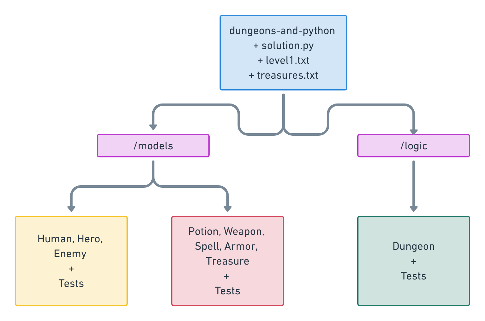

# Dungeons-and-Pythons

Team **Crocodile**
------------------

[Chrisy](https://github.com/hpmalinova)

[Tsvetomir](https://github.com/TsvetomirTsvetkov)

The task
--------

**Summary**

*Mostly taken from HackBulgaria's github:*

- We are going to make a simple, 2D turn-based console game filled with dungeons and pythons!

- We are going to have hero, enemies, weapons, treasures and magic!

Some of the methods that we need to implement:

- known_as()
- get_health()
- take_damage(damage_points)
- take_healing(healing_points)
- take_mana(mana_points)
- attack()
- *and possibly many more*

Some of the classes we need to make:

- Hero
- Enemy
- Weapon
- Spell
- *and possibly many more*

Our solution
------------

**Our initial idea**

**Our packaging**

